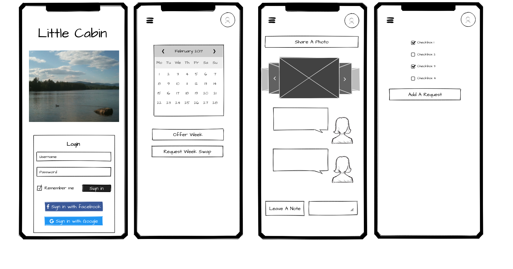
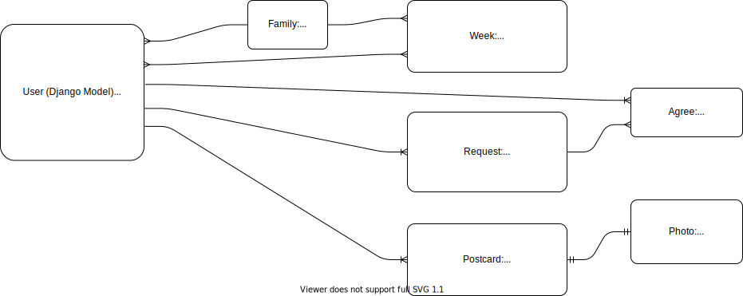
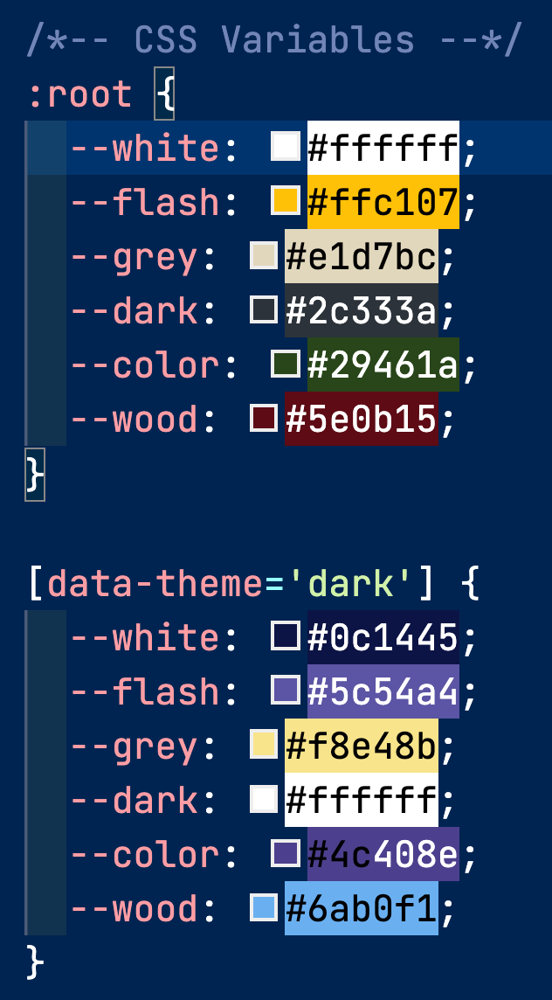

# [Little Cabin App](https://littlecabin.herokuapp.com)


### Little Cabin is a single web app that provides multiple management tools such as:

- Shared Group Calendar
- Private Social Media Network
- Collaborative To-Do List
- Info Center

## Project Planning

My initial planning started by writing out my user stories, and conceptually working through all of the actions I personally had wished I could do in an app to help manage our family's camp.

_As A User (Not Logged In) I Want To:_

- View information about the app itself, and understand why I would want to make an account for an existing managed property, or use the app for my own property
- View app in a variety of themes (dark, light, eventually forest, beach, mountain, etc)

_As An Authorized User I Want To:_

**Account**

- Register a new account, and be automatically pre-approved based on an admin "whitelist"
- Log in to my existing account, using the email address I registered with
- Log out of an account
- View the current weather conditions at my family property

**Postcards**

- View existing postcards, with the most recent at the top
- Create a new postcard (greeting and message)
- Upload a photo to my postcard
- Delete one of my existing postcards
- Edit one of my existing postcards

**Calendar**

- See existing property schedule as list
- See integrated Google Calendar to allow syncing to personal calendar
- Offer to swap one of my weeks for another family's week

**Requests**

- Add a request
- Mark a request as completed
- Hide completed tasks
- See completion progress of my requests and all requests in the last year

**Info**

- View emergency, legal, and other information about the property
- View nearby business info
- View my family tree

**UI/UX**

- Report a bug to the property admin
- View app on a variety of devices responsively

**Stretch Goals**

- Log in using Facebook, Google, etc
- Signup for notifications (text, email) when actions occur such as a request for one of my weeks is made, or a family member reacts to one of my postcards
- Sort the businesses by family recommendations, dynamically load via API
- Recommend a business on the list
- Upload a photo for my leaf of the tree
- "Agree" with an existing request to prioritize it
- Offer one of my weeks up for sale
- Request to purchase another family's week
- Add an emoji reaction to someone's post

### Structure

After the stories were in place, I categorized those stories, leaving me with the general navigation structure of the entire site and its pages. The Home page (not logged in) would display info mainly about Little Cabin, the app. All other pages would be private and only available if logged in; those would display and manipulate information about the property itself.

### Open Access Pages (Not Logged In / Unauthorized Users)

- Home
  - About (Public info about Little Cabin App)
- Login
- Register

### Authorized Access Pages

- Postcards
- Calendar
- Requests
- App Info

### Wireframes

On [Chuck](https://github.com/chuckchoiboi)'s recommendation, I used [Mockflow](https://mockflow.com/) to quickly and easily sketch some initial wireframes for these main page views.



### Pitch Deck

I then used Google Slides to create a [pitch deck](https://docs.google.com/presentation/d/1wABAwaZubhI4hExwqxWG6zBW7y5OyL_w92NW8NEWQnM/edit#slide=id.gd480e80180_0_52) to present to my stakeholders, and receive their feedback on project scope, tech and design pattern suggestions, and field initial questions and concerns.

## Building

I intentionally started this project from the _user_ perspective; getting an attractive frontend built as quickly as possible (using Bootstrap) to help make the project "real" and inspire ideas for features at an early stage. In previous large projects I had started by building backend instead (API, and databases models), however using a new framework (Django) and new database (PostgreSQL) for this project meant it would be easiest to have the schema conceptually as complete as possible before starting to actually write to the database.

### ERD

To assist in developing the data models, I sketched an ERD (entity relationship diagram) to help visualize the way the various objects would interact. This working sketch also made it simple to conceptualize new features, and adapt the models' properties before committing them to database tables.



### Style Guide

Since I was creating this project on my own, the function of my style guide was more to help me keep track of design and copy ideas that I liked, rather than to strictly guide team members on a unified style. The choices certainly evolved and shifted as the app expanded, but updating the guide as the "source of truth" was essential to the workflow, even when working alone. It saves time to be able to copy/paste HEX color codes, font styles, terminology and slogans, etc, and reduces executive function required to make all of those tiny decisions over and over.

### Colors:



Light Mode (default)
--white: #ffffff;
--flash: #ffc107;
--grey: #e1d7bc;
--dark: #2c333a;
--color: #29461a;
--wood: #5e0b15;

[data-theme='dark']
--white: #0c1445;
--flash: #5c54a4;
--grey: #f8e48b;
--dark: #ffffff;
--color: #4c408e;
--wood: #6ab0f1;

### Fonts:

- Main Text: Montserrat
- Accent Headings: Raleway

### Terminology

- **Property**: the family location and structure being managed. Might refer to a "camp", "cabin", "lake house", "vacation home", "cottage", or other regional terms
- **Request**: a ToDo-style item including maintenance requests, etc
- **Week**: the unit of time a particular user or users has exclusive access to the property
- **Postcard**: a social media post including a written note and an optional photograph

### Copy

- **Title**: Little Cabin App
- **Subtitle**: Securely share your family get-away
- **Tagline**: Make Memories, Not Spreadsheets
- **Summary**: Little Cabin is a single web app that provides multiple management tools such as:
  - A shared schedule with permissions-based week swapping and Google Calendar integration
  - A micro social media network allowing family members to share virtual "postcards" (short notes with accompanying photos uploaded from their device)
  - A collaborative list collecting requests from members on maintenance items, purchase ideas, and other helpful suggestions. Members can edit or complete anyone's request, hide completed tasks, and view real-time reports on task completion rates
  - A knowledge repository with helpful information including contact info for local businesses and emergency protocols, historical information about the property, a family tree to see members, and (coming soon) legal trust information, weekly chores, dues schedule, and more

## Tech Used

- Python
- Django
- HTML / CSS / Bootstrap
- PostgreSQL
- Amazon AWS
- Google Calendar API
- Google Cloud Service Account
- Open Weather API
- Random User API
- Heroku

### Django

I followed [my own blog post](https://blog.benhammond.tech/django-getting-started) to get a "Hello World" Django application running locally, and then again followed my post [part 2 to deploy to Heroku](https://blog.benhammond.tech/deploying-django-to-heroku). I wanted the simplest possible app deployed early, so that eventual troubleshooting would be easier to pinpoint.

## Accessibility

Following the ethos of "accessibility is not a feature", I am making an effort to improve my projects by making and keeping them accessible from the very start. I have _much_ to learn in this space, but to start I frequently run the Lighthouse report tool in Chrome Dev Tools. This is not a complete testing, but it helps with the lowest hanging fruit:

- including a brief, descriptive `alt` attribute to add alternate text to your `` tags. For _decorative_ images (those which are simply aesthetic or redundant based on adjacent text) it is recommended to set `alt=""` so that screen readers will know to skip it
- setting an `aria-label` attribute on any links or buttons that don't include descriptive text. In my case, the template's hamburger menu was an svg file, so it made sense to also label that image as `aria-hidden="true"` to let the screen reader know it didn't need to interpret that graphic
- organizing your headings hierarchy (`<h1>`-`<h6>`); in general there should only by one `<h1>`, and all subheadings should be in order (e.g. don't skip `<h3>` by going directly from an `<h2>` to an `<h4>`)
- ensuring the color contrast every bit of text and its background is high enough to be read

## Problems Solved

> This Section will be formatted and split off into multiple blog posts and tweets in hopes of savings fellow devs and future me from making the same mistakes

- Building the project from the user's perspective, i.e. getting a working frontend displayed as quickly as possible. integrating an existing design into an extensible Django base template
- fixing deployment issues with DEBUG config vars
- integrating css variables (custom properties) with existing design to make future changes as simple as possible
- extending Django's `UserCreationForm`; requiring `first_name`, `last_name`, and `email`, and removing the field for `username`; actually presented `username` as **Email** to user for all account related services (Register, Login, etc), since all the solutions recommended creating a custom user model _before starting the project_..... too late.
- custom pagination (view one year at a time). sending value out from form btn into the views. saving fetched data in big chunk into db, and reading from there unless data is stale then refetching
- [Extending UserCreationForm](https://dev.to/yahaya_hk/usercreation-form-with-multiple-fields-in-django-ek9)
- https://developers.google.com/calendar/quickstart/python
- https://github.com/googleworkspace/python-samples/issues/134
- https://stackoverflow.com/questions/63956706/google-drive-api-quickstart-py-error-400-redirect-uri-mismatch
- need to add credentials file, and need to gitignore it
- need to run Google's Python "quickstart" commands INSIDE the env
- https://github.com/googleworkspace/python-samples/issues/134
- https://stackoverflow.com/questions/63956706/google-drive-api-quickstart-py-error-400-redirect-uri-mismatch
- use template filters to calculate previous and subsequent years for buttons and post request values. conditionally rendering "previous year" button to deny viewing past years.
- different colors of icon/favicon/logo
- Manually pivoting a table lookup; each Postcard contained an owner username, but I needed to get `first_name` and `last_name`; in the `view` method I looped through the postcards, and then built a context dictionary which contained a list of Postcards bundled with their User authors. This was I was able to easily access the Postcard info in the template using `{{ card.author.first_name }}`
- naming collisions: bug with view method named "postcards" and list of objects from the database "postcards". Also, named my to-do items "Request" objects, which is confusing with the built in request keyword from Django's HTTP request/response framework
- adding checkbox _inside_ the to-do item; required using `<button>` instead of `<input />` to place the svg graphic inside each generated form.
- todo list: conditional rendering of "hide completed" button; calculating completion rates in the view method and then sending through to display as progress bars.
- deploying to Heroku with Google Cloud Platform which requires a `credentials.json`, had to move the json file to the floor, change the name, install a special buildpack, and add two new config vars. still wasn't able to get the credentialing screen to display to the user (instead it was logging the link in the Heroku logs).
- learned that Heroku config vars are ALWAYS strings, meaning when I had set `DEBUG` to `False` for production, it was actually reading the string `"False"` which it was evaluating as `True`. I was able to fix this by simply setting a different config var for development and production and then assign `DEBUG` as needed. This was resulting in a 500 Error; which took significant debugging to fix. First, followed [this stack overflow](https://stackoverflow.com/questions/52311724/500-error-when-debug-false-with-heroku-and-django) and set up detailed logging to discover the real issue that was causing the 500 error. It turns out it was a `ValueError: Missing staticfiles manifest entry for` one of my images. To remedy this error, I went into my terminal with the virtual environment activated, and ran `python3 manage.py collectstatic`. Still not entirely sure what this did, other than make copies of almost all of the images I had used in the project which increased my deploy and push times. But it basically hooked everything up image-wise for Django, and fixed the 500 error.
- Conditionally render the "edit" and "delete" buttons as accessible icons; even though the two variables were displaying the same, the current username was returning `False` when compared against the postcard owner. I was able to fix this by using a Django template tag to convert them to the same type of string ``
- Needed to extend the builtin DeleteView class, and also to my detail function (for create and update) to lookup the Photo(s) that contained the currently detailed Postcard. This allowed all of these views to display the postcard along with its photos, even though the relationship is 1 POSTCARD->MANY PHOTOS, and therefor it's the Photo class that contains a Postcard foreign key. Had to overwrite the `get_context_data()` method to do the lookup, and then bundle those Photos into the returned `context`.
- Decided not to limit CRUD on the shared to do requests; this way anyone is able to edit an existing request (and fix a spelling error, or add details), complete a request, and then hide all complete requests. This only works since the view is for screened, authorized users. I decided to skip the pencil icon and instead make clicking the text of the request item the "edit" function, and then the complete/incomplete would be handled by the checkbox. I have some concerns that the way I've designed it might be less accessible than if I had relied on the browsers built-in check box.
- Make the postcards feel more "real world" by adding a tiny bit of random tilt to their display, and having them straighten and expand when hovering with mouse.
- Limit access to the app to users who have been approved; to do this I used the Group property of Django's built in User model. This creates a many-to-many relationship, and allows filter() and get() requests to the database to delegate functionality based on the group. I created a "member" group who's users have full create/read/update/destroy (CRUD) access to postcards, requests and weeks, and an "admin" group who's users will see and approve new member requests. Specifically, the admin `home` view queries the database for all users expect those who are already in the "member" group: `User.objects.all().exclude(groups__name='member')`, and then displays that list with associated "approve" buttons:
  ```django
  
    <li>
      <span>{{pending_user.first_name|title}} {{pending_user.last_name|title}} ({{pending_user.username}})</span>
      <a href="">Approve</a>
    </li>
  
  ```
- implementing Swap objects (pending offers to swap Week objects between Groups, initiated and approved by Users). LOTS OF STUFF. this was hard
- error after adding "created"; used default value of `1` which didn't make sense, and wasn't able to run `migrate` even after dropping and recreating the db. Had to manually go into the migrations folder and alter the value of `default=1` to `default=django.utils.timezone.now`.
- setting up automatic creation of `owner_group`s in the db using a data migration.
- ordering my groups, decided to append a number so they were sortable
- avoiding name collisions; used `import calendar as calendar_lib` since I was already using `calendar` as a view method
- displaying a dropdown `<select>` with every pending user displayed to an admin; admin can then choose the correct owner_group and approve, or deny the user and delete the uncredentialed user. This was also complex; mainly in deciding between using Django's built-in form handling, and digging through obscure and tangential examples. I decided to implement it myself, changing my approve button from being an `<a>` to being a `<button>` inside of a `<form`>, and then adding a hidden `<input>` to contain the `user.id` . I also placed the `<select>` inside the same form, and then made `home/` intercept post requests and process the incoming data by finding the User, finding the Group, then adding the user to that group.
- I would love to have the "Approve" buttons stay disabled until the admin selects a Group; I tried using `required` in the `<select>` but that didn't work; I also researched using Javascript inside the view but it got complex due to the possibility of multiple, programmatically generated dropdowns and associated approve buttons.
- calculating an end date required adding a dateTime delta of 7 days, and then rendering that dateTime as a string to be sent to Google API
- Syncing is possible, since we can know that every actual week will have a maximum of 1 Week object in our database, and also a maximum of 1 google calendar event. So rather than simply wiping gcal and pushing every week from the db when there is a change, it's possible to do incremental synchronization. Some strange errors were isolated and fixed by realizing that the get all events was actually being limited, thereby leaving some straggler events on the calendar. This was fixed by explicitly setting the maximum number of results to 2500 (the highest allowed): `events_result = service.events().list(calendarId=CAL_ID, maxResults=2500).execute()`. Some other errors involved typing; my Week model was using dateTime and the Google Calendar events use strings in the same format, so printing to debug didn't help until I included `type(start_date)`.
- aligning automatically generated forms in Django; required displaying them as a table instead of `<p>` elements, and then adding my bootstrap classes to the table surrounding the template tag.
- adding a "Demo Login" button to allow people quickly just checking out the app to have a useable account and populated data from other auto-generated users. Not every person is going to create an account just to check out your little project, so making it as easy as possible to see what's behind the login screen
- adding a theme switcher; I adapted a light/dark mode tutorial to just adjust the colors. Eventually it would be great to have a lake theme, mountain theme, beach theme, and other relevant vacation vibes. The theme switcher relies on CSS variables which I was already using, so it would pretty quick to set up. It also records the user's preference in localstorage, so the theme persists between sessions. I learned several things throughout this process, including the benefits of naming your variables based on their role or context, rather than their general color. Also, learned how to place bootstrap color utility classes `bg-dark` on containing `<div>`s to cascade that color class to all the contained text elements(`<p>`, `<a>`, etc) rather than adding classes to every element
- I wanted a visual representation of the family, not only for the historical and social aspect, but also to represent to people viewing the app exactly how complicated managing so many user in sub-families can be. If I were building in React I would have created a dynamic, component based family tree, and I still may. But for now, I decided to just create a static image and to use the tree as an exercise in learning Figma, which I have recently been exploring.
- I wanted to let members view the current weather conditions at the property; this turned out to be significantly more involved than anticipated. I first need to make a call to the weather api, which was straightforward, particularly compared to the Google Calendar API. Next I needed a way of displaying the info, and settled on the side nav menu since it would be available on every page. However, the API is rate-limited and there would be no need to recall the API every time the page loaded, but instead every several minutes. To accomplish this, I created a model `WeatherReport` which stored the temp, conditions, and timestamp. Then, whenever the page is reloaded, it checked the freshness of the weather report in the database and repings the API as needed. Also significantly tricky was sending variable data (the weather conditions) to my `base.html` template which was providing my nav and footer for every page. To do this, I created another custom template tag (similar to how I was able to add anchor links partway down my home page). This allowed me to run the logic needed in a python file, and then call and retrieve the string answer in my template using `
- swapping the events on Google Calendar was resulting in all the data other than dates and owner names being erased; this ended up being a result of using `update()` (which sends a PUT request), rather than `patch()`, which sends a PATCH request. PUT was replacing the entire event object, whereas PATCH edits only the fields sent in the request and leaves the rest of the resource as is.
- template I used has a slide-in side menu for smaller screen sizes, and by default the only way to close that menu (without clicking an item) is a tiny little "x" in the corner. Modern UX seems to trend towards clicking "off the popup" will work to close a menu, so I was able to understand how the template's JavaScript was working, and apply the same ` closeSidenavFunc()` in an event listener attached to the grayed out background that was covering the rest of the screen already.

## Tools and Libraries

- [Font Awesome](https://fontawesome.com/) - Icons
- [Metatags.io](https://metatags.io/) - Meta Tags
- [Mockflow](https://mockflow.com/) - Wireframes
- [Figma](https://www.figma.com/) - Graphics
- [Favicon.io](https://favicon.io/) - Favicon
- https://www.remove.bg/
- [Random User API](https://randomuser.me/api/)
- [Open Weather API](https://openweathermap.org/)

## Resources

- [PngItem](https://www.pngitem.com/) - Icon
- Unsplash: [Cabin Photo](https://unsplash.com/@olivier_twwli?utm_source=unsplash&utm_medium=referral&utm_content=creditCopyText), [Firewood Photo](https://unsplash.com/@markuswinkler?utm_source=unsplash&utm_medium=referral&utm_content=creditCopyText), [Watering Can Photo](https://unsplash.com/photos/uWfYjWM8oGM?utm_source=unsplash&utm_medium=referral&utm_content=creditShareLink)
- http://clipart-library.com/
- [Koka](https://angrystudio.com/themes/koka-free-bootstrap-5-website-template/) - Bootstrap Template
- [Route Back To Section IDs](https://engineertodeveloper.com/a-better-way-to-route-back-to-a-section-ids-in-django/) - Blog Post
- [Extending UserCreationForm](https://dev.to/yahaya_hk/usercreation-form-with-multiple-fields-in-django-ek9) - Blog Post
- [Quickstart Google Calendar API - Python](https://developers.google.com/calendar/quickstart/python) - Guide
- [Accessibility for Hamburger Menu](https://medium.com/@linlinghao/accessibility-for-hamburger-menu-a37fa9617a89) - Blog Post
- [Adding Google Cloud Credentials To Heroku](https://devdojo.com/bryanborge/adding-google-cloud-credentials-to-heroku) Blog Post
- Stack Overflow: [500 Error When Debug False With Heroku And Django](https://stackoverflow.com/questions/52311724/500-error-when-debug-false-with-heroku-and-django), [Getting last Monday of a month](https://stackoverflow.com/questions/12796389/python-get-last-monday-of-july-2010/12796542), [Using Service Account with Google API](https://stackoverflow.com/questions/49480930/django-server-rw-access-to-self-owned-google-calendar)
- [Intro to Google Developer Service Account](https://www.daimto.com/google-developer-console-service-account/) - Blog Post
- [Google Cal Integration Django](https://stackoverflow.com/questions/37754999/google-calendar-integration-with-django)
- [Light/Dark Mode with CSS Variables](https://dev.to/ananyaneogi/create-a-dark-light-mode-switch-with-css-variables-34l8) - Blog Post

## Repo

- [GitHub](https://github.com/benhammondmusic/littlecabin/)

## Deployed Website

- [littlecabin.herokuapp.com](https://littlecabin.herokuapp.com)
