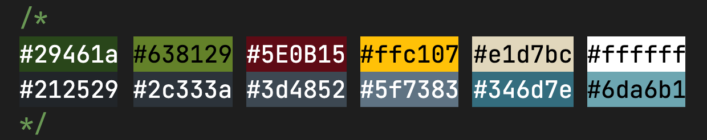

# Little Cabin

> Securely share your family's get-away and memories.

Secure, family-only web application providing:

- shared group calendar with permissions-based week swapping and selling
- micro social media network offering "postcards" (short note with a photo)

- collaborative "to-do" style list collecting suggestions from members on maintenance items, purchase ideas, or other helpful suggestions. Members can "agree" and upvote requests
- knowledge center with important information including legal trust information, weekly chores, dues schedule, contact info for local businesses and emergency protocols

## Planning

### User Stories

My initial planning started by writing out my user stories, and conceptually working through all of the actions I personally had wished I could do in an app to help manage our family's camp.

_As A User I Want To:_

**Not Logged In**

- View information about the app itself, and understand why I would want to make an account for an existing managed property, or use the app for my own property

**Account**

- Register a new account, and be automatically pre-approved based on an admin "whitelist"
- Log in to my existing account, using the email address I registered with
- Log out of an account

- Log in using Facebook, Google, etc

**Postcards**

- View existing postcards, with the most recent at the top
- Create a new postcard (greeting and message)
- Upload a photo to my postcard

* Delete one of my existing postcards
* Edit one of my existing postcards
* Add an emoji reaction to someone's post

**Calendar**

- See existing property schedule

* Offer one of my weeks up for sale
* Offer to swap one of my weeks for another family's week
* Request to purchase another family's week

**Requests**

- Add a request
- Mark a request as completed
- Hide completed tasks

* "Agree" with an existing request to prioritize it

**Info**

- View emergency, legal, and other information about the property

* View nearby businesses
* Sort the businesses by family recommendations
* Recommend a business on the list
* View my family tree
* Upload a photo for my leave of the tree

**UI/UX**

- Report a bug to the property admin
- View app on a variety of devices responsively

* View app in a variety of themes (dark, light, forest, beach, mountain, etc)
* Signup for notifications (text, email) when actions occur such as a request for one of my weeks is made, or a family member reacts to one of my postcards

## Structure

After the stories were in place, I categorized those stories, leaving me with the general navigation structure of the entire site and its pages. The Home page (not logged in) would display info mainly about Little Cabin, the app. All other pages would be private and only available if logged in; those would display and manipulate information about the property itself.

### Open Access Pages (Not Logged In / Unauthorized Users)

- Home
  - About (Public info about Little Cabin App)
- Login
- Register

### Authorized Access Pages

- Postcards
- Calendar
- Requests
- App Info
  - Emergency Info
  - Weekly Chores
  - Local Business Recommendations
  - Property History
  - Family Tree
  - Legal Trust Info

### Wireframes

On [Chuck](https://github.com/chuckchoiboi)'s recommendation, I used [Mockflow](https://mockflow.com/) to quickly and easily sketch some initial wireframes for these main page views.

### Pitch Deck

I then used Google Slides to create a pitch deck to present to my stakeholders, and receive their feedback on project scope, tech and design pattern suggestions, and field initial questions and concerns.

### Building

I intentionally started this project from the _user_ perspective; getting an attractive frontend built as quickly as possible (using Bootstrap) to help make the project "real" and inspire ideas for features at an early stage. In previous large projects I had started by building backend instead (API, and databases models), however using a new framework (Django) and new database (PostgreSQL) for this project meant it would be easiest to have the schema conceptually as complete as possible before starting to actually write to the database.

## ERD

To assist in developing the data models, I sketched an ERD (entity relationship diagram) to help visualize the way the various objects would interact. This working sketch also made it simple to conceptualize new features, and adapt the models' properties before committing them to database tables.

### Style Guide

Since I was creating this project on my own, the function of my style guide was more to help me keep track of design and copy ideas that I liked, rather than to strictly guide team members on a unified style. The choices certainly evolved and shifted as the app expanded, but updating the guide as the "source of truth" was essential to the workflow, even when working alone. It saves time to be able to copy/paste HEX color codes, font styles, terminology and slogans, etc, and reduces executive function required to make all of those tiny decisions over and over.

#### Colors:

#### Terminology

- **Property**: the family location and structure being managed. Might refer to a "camp", "cabin", "lake house", "vacation home", "cottage", or other regional terms
- **Request**: a ToDo-style item including maintenance requests, etc
- **Week**: the unit of time a particular user or users has exclusive access to the property
- **Postcard**: a social media post including a written note and an optional photograph

### Tech

- Python
- Django
- HTML / CSS / Bootstrap
- PostgreSQL
- Amazon AWS
- Google Calendar API
- Heroku

#### Django

I followed [my own blog post](https://blog.benhammond.tech/django-getting-started) to get a "Hello World" Django application running locally, and then again followed my post [part 2 to deploy to Heroku](https://blog.benhammond.tech/deploying-django-to-heroku). I wanted the simplest possible app deployed early, so that eventual troubleshooting would be easier to pinpoint.

# Problems Solved (work in progress)

- Building the project from the user's perspective, i.e. getting a working frontend displayed as quickly as possible. integrating an existing design into an extensible Django base template
- fixing deployment issues with DEBUG config vars
- integrating css variables (custom properties) with existing design to make future changes as simple as possible
- extending Django's `UserCreationForm`; requiring `first_name`, `last_name`, and `email`, and removing the field for `username`; actually presented `username` as **Email** to user for all account related services (Register, Login, etc), since all the solutions recommended creating a custom user model _before starting the project_..... too late.
- custom pagination (view one year at a time). sending value out from form btn into the views. saving fetched data in big chunk into db, and reading from there unless data is stale then refetching
- [Extending UserCreationForm](https://dev.to/yahaya_hk/usercreation-form-with-multiple-fields-in-django-ek9)
- https://developers.google.com/calendar/quickstart/python
- https://github.com/googleworkspace/python-samples/issues/134
- https://stackoverflow.com/questions/63956706/google-drive-api-quickstart-py-error-400-redirect-uri-mismatch
- need to add credentials file, and need to gitignore it
- need to run Google's Python "quickstart" commands INSIDE the env
- https://github.com/googleworkspace/python-samples/issues/134
- https://stackoverflow.com/questions/63956706/google-drive-api-quickstart-py-error-400-redirect-uri-mismatch
- use template filters to calculate previous and subsequent years for buttons and post request values. conditionally rendering "previous year" button to deny viewing past years.
- different colors of icon/favicon/logo
- Manually pivoting a table lookup; each Postcard contained an owner username, but I needed to get `first_name` and `last_name`; in the `view` method I looped through the postcards, and then built a context dictionary which contained a list of Postcards bundled with their User authors. This was I was able to easily access the Postcard info in the template using `{{ card.author.first_name }}`
- naming collisions: bug with view method named "postcards" and list of objects from the database "postcards". Also, named my to-do items "Request" objects, which is confusing with the built in request keyword from Django's HTTP request/response framework
- adding checkbox _inside_ the to-do item; required using `<button>` instead of `<input />` to place the svg graphic inside each generated form.
- todo list: conditional rendering of "hide completed" button; calculating completion rates in the view method and then sending through to display as progress bars.

## Resources

- [Koka](https://angrystudio.com/themes/koka-free-bootstrap-5-website-template/)
- [Font Awesome Icons](https://fontawesome.com/)
- [Route Back To Section IDs](https://engineertodeveloper.com/a-better-way-to-route-back-to-a-section-ids-in-django/)
- [Extending UserCreationForm](https://dev.to/yahaya_hk/usercreation-form-with-multiple-fields-in-django-ek9)
- [Quickstart Google Calendar API - Python](https://developers.google.com/calendar/quickstart/python)
- [Accessibility for Hamburger Menu](https://medium.com/@linlinghao/accessibility-for-hamburger-menu-a37fa9617a89)
